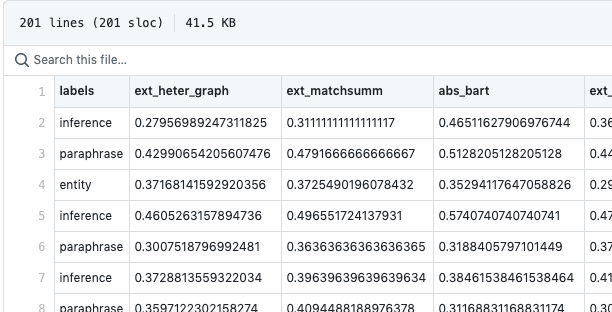

Code and data for "How well do you know your summarization datasets?", submitted to ACL 2021.
---

This repository contains the code and data used in the paper titled "How well do you know your summarization datsets?" submitted to [ACL 2021](https://2021.aclweb.org/calls/papers/). From the abstract:
> ... In this study, we manually analyse 600 samples from three popular summarization datasets. Our study is driven by a six-class typology which captures different noise types (missing facts, entities) and degrees of summarization difficulty (extractive, abstractive). We follow with a thorough analysis of 27 state-of-the-art summarization models and 5 popular metrics, and report our key insights ...

We include the following classes in the typology:
1. Incomplete/Ireelevant: `_incomplete`
2. Entity Missing: `_entity`
3. Evidence Missing: `_evidence`
4. Extractive: `_extractive`
5. Paraphrase: `_paraphrase`
6. Inference: `_inference`

# Notes on general organization.
For each dataset, the *raw* input data is stored in 2 forms:
1. **Indices**: Each line in this file corresponds to the line/sample number of the test dataset.
2. **Labels**: Each line in this file is the annotated typology label assigned to the test sample.

With these files, and the test source/reference data, we can extract the samples and perform any custom analysis. Model outputs can be found in the respective dirs of the datasets:
* **Gigaword**: `./giga-org-test-shuf-1to300`
* **CNN/DM**: `./cnndm-300`
* **XSum**: `./xsum-200`

Every directory in the dataset directory is a different model, that contains the source, target and model outputs. Consider the files in [BiSET](https://www.aclweb.org/anthology/P19-1207/) dir for Gigaword:
```bash
giga-org-test-shuf-1to300/biset$ find ./
./
./_all.src.txt
./_all.tgt.txt
./_all.hypo.txt
./_entity.src.txt
./_entity.tgt.txt
./_entity.hypo.txt
./_evidence.src.txt
./_evidence.tgt.txt
./_evidence.hypo.txt
...
```
* `_all` contains all test samples in order of the Indices file.
* `_<label>.src.txt` contains the source text.
* `_<label>.tgt.txt` contains the target text.
* `_<label>.hypo.txt` contains the model output text.
* `<label>` values can be `[all, incomplete, entity, evidence, extractive, paraphrase, inference]`


# Raw data
### Gigaword
* **Indices**: `./giga-org-test-shuf-1to300/test_indices_top200.txt`
* **Labels**: `./giga-org-test-shuf-1to300/labels_final.txt`
* **Source/Targets/Hypos:** `./giga-org-test-shuf-1to300/<model_dir>/`
* **Models:** `[pegasus, coverage, pgcov, prophet, unilm-v2, biset, control-copying]`

### CNN/DM
* **Indices**: `./cnndm-300/cnndm_indices.txt`
* **Labels**: `./cnndm-300/labels_final.txt`
* **Source/Targets/Hypos:** `./cnndm-300/<model_dir>/`
* **Models:** `[pnbert, bart-ext, bart-abs, unilm, ext_heter_graph, ext_matchsumm, ext_refresh, abs_two_stage_rl, abs_neusumm, abs_bottom_up, abs_semsim, abs_unilm, ext_bart, ext_banditsumm, abs_bart]`

### XSum
* **Indices**: `./xsum-200/xsum_indices.txt`
* **Labels**: `./xsum-200/labels.txt`
* **Source/Targets/Hypos:** `./xsum-200/aligned/<model_dir>/`
* **Models:** `[tconvs2s, presumm_ext_abs, presumm_abs, pgnv, presumm_trans, lead, ext_oracle, bart, convs2s]`

# Computing metrics and results
## Pre-computed
Given the large number of models and metrics involved, we have pre-computed all metrics against all movel outputs, and saved them in csv files. These files are saved for each dataset, in their respective dataset directories and start with `df_*` for each metric. Looking at the CNN/DailyMail files:
```bash
~/howwelldoyouknow/cnndm-300$ find ./ -name "df_*.csv"
./df_berts.csv
./df_rouge1.csv
./df_rouge2.csv
./df_rougeL.csv
./df_pyramid.csv
./df_mvrs1.csv
```

The metrics used for each dataset can be found in the paper. Each file is organized as follows:
* First row is the header.
* All rows after the header are in order of the Indices file.
* First column is the `label` for the sample.
* All successive columns contain the score for a specific model used for that dataset.

Sample from [CNN/DM ROUGE-1 csv](https://github.com/anonymous-6502/howwelldoyouknow/blob/master/cnndm-300/df_rouge1.csv)


## Results
We use the Jupyter Notebooks in the `notebooks` folder for doing all data analysis on the model scores. The different files and their purpose is listed below:
```bash
~/howwelldoyouknow/notebooks$ find ./
./
./analysis_gigaword.ipynb  # All analysis for Gigaword
./analysis_cnndm.ipynb  # All analysis for CNN/DM
./analysis_xsum.ipynb  # All analysis for XSum
./pretty_heatmaps.ipynb  # Generating high-res heatmaps for the paper
```

## Re-compute
If you wish to compute the metrics yourself, you will have to install some packages. Note that some metrics (like Moverscore, BertScore) might take time.

We use Conda for managing environments. Please install Python 3.6.12 and [Conda](https://docs.conda.io/projects/conda/en/latest/index.html) 4.8.3 . Conda is included with the [Anaconda distribution](https://www.anaconda.com/products/individual). After installing `conda`, run the following commands for each model output and target reference individually:
```bash
$ conda env create -f environment.yml  # Setup the env.
$ conda env list
# conda environments:
moverscore              /location/
...
$ conda activate moverscore
$ pip install -r requirements.txt  # Install the pip packages.
```

To get ROUGE scores, run the following script:
```bash
$ python compute_rouge.py -h
usage: compute_rouge.py [-h] prefix_string labels_file results_dir

positional arguments:
  prefix_string  Prefix string.
  labels_file    File containing label enums.
  results_dir    Dir with tgts+hypos.

optional arguments:
  -h, --help     show this help message and exit
```

To compute MoverScores, run the following script:
```bash
$python compute_mover.py -h
usage: compute_mover.py [-h] prefix_string labels_file large_hypos large_refs results_dir

positional arguments:
  prefix_string  Prefix string.
  labels_file    File containing label enums.
  large_hypos    Large collection train/test of model generated hypos.
  large_refs     Large collection train/test of gold targets.
  results_dir    Dir with label-separated tgts+hypos.
  
optional arguments:
  -h, --help     show this help message and exit
```
